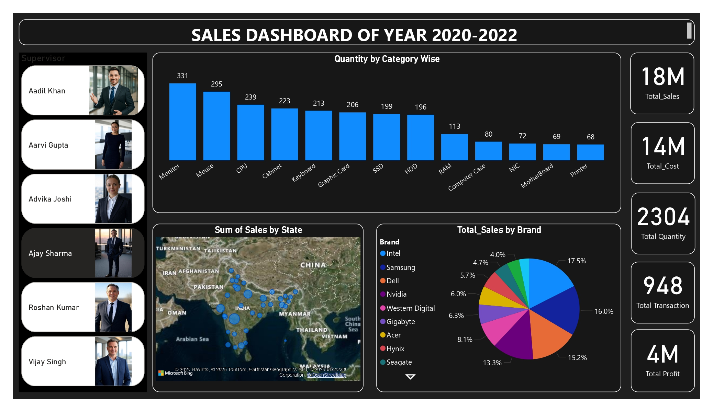

# Salesman Sales Dashboard

This repository contains a Power BI sales dashboard that provides insights into sales performance.

## Dashboard

Here is a screenshot of the dashboard:

## Data Source

The dashboard is based on the data in the following Excel file:

*   [Complete_Techno_Sales_Data-2.xlsx](Complete_Techno_Sales_Data-2.xlsx)

## How to Use

To explore the dashboard, you will need to have [Power BI Desktop](https://powerbi.microsoft.com/en-us/desktop/) installed. You can then open the `Sales Dashboard.pbix` file to view and interact with the dashboard.

## Tools Used

*   Power BI
*   Microsoft Excel
